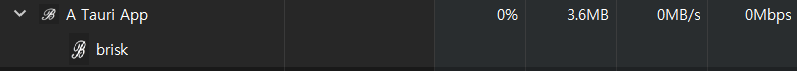

# Brisk - Minimal Local Music Player

Brisk persues for the top-notch in minimalistic UI design.

## Made by Iansong w/ Tauri and Vanilla HTML/CSS/JS

## How to use

1. Donwload .exe file or Installer on **Release Page**.
1. Move .exe file to the directory you want to keep it.
1. Double Click to open the app. The app will automatically generate audio/ and config/ directory and generate some mp3, json files.

