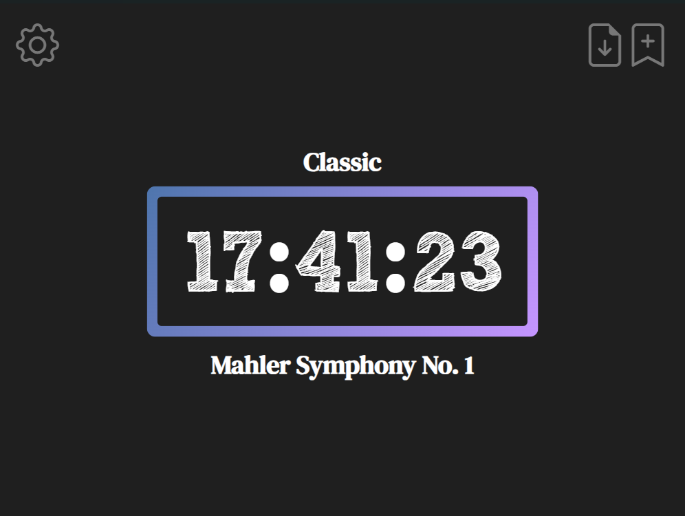
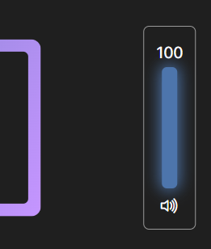
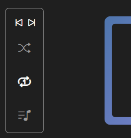
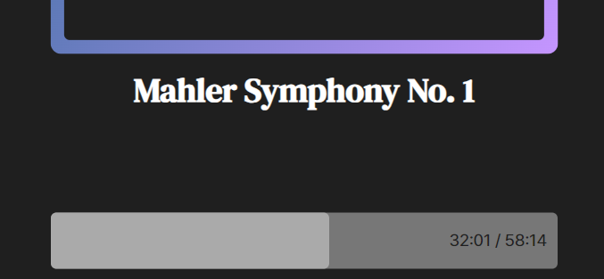

# Brisk - Minimal Local Music Player

Brisk persues for the top-notch in minimalistic UI design.

## Made by Iansong w/ Tauri and Vanilla HTML/CSS/JS

## How to use

1. Donwload .exe file or Installer on **Release Page**.
1. Move .exe file to the directory you want to keep it.
1. Double Click to open the app. The app will automatically generate audio/ and config/ directory and generate some mp3, json files.

### Keymap
|Key|Function|
|-|-|
|Toggle play/pause|Space|
|Fast forward 5 seconds|→|
|Rewind 5 seconds|←|
|Toggle full screen|F11|
|Seek to starting point|Home|
|Seek to end|End|
|Increase Volume by 5%|↑|
|Decrease Volume by 5%|↓|

### Interface

Light blue outline indicates that the audioback is paused, and Violet is playing.

Volume bar is on the left side, which appears when mouse is near the edge.

Right side has the controller.

Bottom has the Timestamp.

Gear button will simplify the interface.

### Well-Optimized Application
Using Rust as Backend and Native HTML Renderer (Microsoft WebView2), the application is optimized to use minimum of CPU and RAM despite harming UX.

Image above shows that the app used only 3.6MB while playing 40 minute long symphony (v0.1-beta.2)
